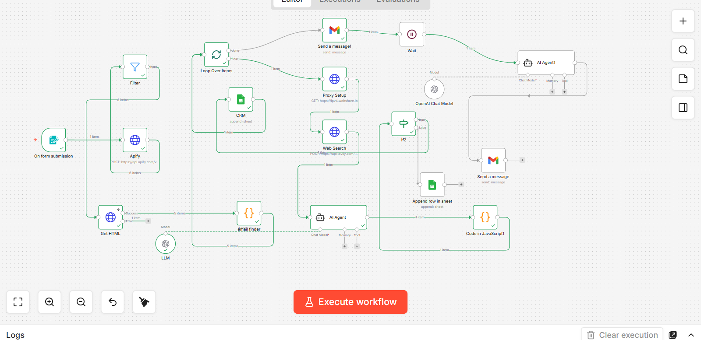

# AI Lead Generation & Automated Outreach System

##  Overview
This project is an end-to-end automated system designed to streamline lead discovery and outreach using **n8n** and **Agentic AI**. It automates the entire process from identifying target businesses to executing personalized email follow-ups, saving hours of manual labor.

##  The Problem
Business development teams often struggle with manual lead prospecting, high research time, and inconsistent outreach. This leads to missed opportunities and inefficient resource allocation.

##  The Solution
This workflow automates the following key operations:
1.  **Lead Discovery:** Automatically identifies target businesses based on specific industries and locations.
2.  **Data Enrichment:** Performs deep research to gather accurate business intelligence.
3.  **AI Analysis:** Utilizes AI agents to evaluate lead data and determine engagement readiness.
4.  **Personalized Outreach:** Leverages **OpenAI API** to generate tailored email drafts for every unique lead.
5.  **CRM Management:** Seamlessly stores records in CRM systems and triggers automated follow-up sequences.

##  Tech Stack
*   **Automation Platform:** n8n
*   **AI Engine:** OpenAI API (GPT-4)
*   **Integrations:** Google Sheets, Gmail, CRM Systems
*   **Core Concepts:** Webhooks, Workflow Automation, API Integration

##  Workflow Architecture

##  Impact
*   **Operational Efficiency:** Reduced lead-to-outreach cycle time by over 80%.
*   **Personalization:** Achieved higher response rates through AI-generated custom messaging.
*   **Scalability:** Eliminated manual entry errors, ensuring 100% data integrity across platforms.

##  Setup Instructions
1.  Download the `lead generation.json` file from this repository.
2.  Open your **n8n** dashboard and select "Import Workflow."
3.  Configure your credentials for **OpenAI API**, **Gmail**, and your specific **CRM**.
4.  Activate the workflow to start automating your outreach.
